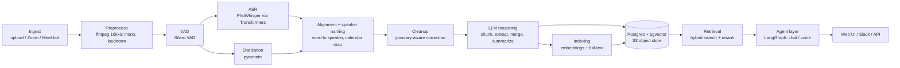

```mermaid
flowchart LR
  A["Ingest<br/>upload / Zoom / Meet bot"] --> B["Preprocess<br/>ffmpeg 16kHz mono, loudnorm"]
  B --> C["VAD<br/>Silero VAD"]
  C --> D["ASR<br/>PhoWhisper via Transformers"]
  C --> E["Diarization<br/>pyannote"]
  D --> F["Alignment + speaker naming<br/>word to speaker, calendar map"]
  E --> F
  F --> G["Cleanup<br/>glossary-aware correction"]
  G --> H["LLM reasoning<br/>chunk, extract, merge, summarize"]
  H --> I[("Postgres + pgvector<br/>S3 object store")]
  H --> J["Indexing<br/>embeddings + full-text"]
  J --> I
  I --> K["Retrieval<br/>hybrid search + rerank"]
  K --> L["Agent layer<br/>LangGraph: chat / voice"]
  L --> M["Web UI / Slack / API"]
```
